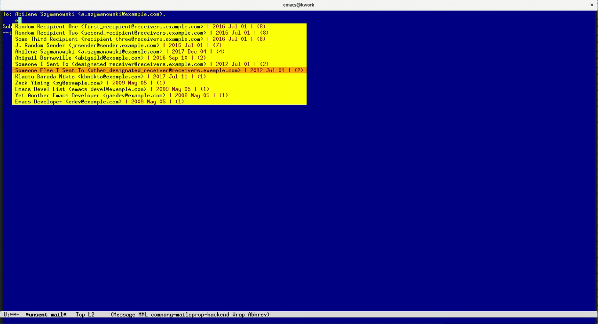

mailaprop: modern autofill for email addresses in GNU Emacs.
============================================================

Overview
--------

Mailaprop provides modern, popup-style autofill of email addresses
when you're composing messages in Emacs:

  

As you start typing a name or an address, a popup window offers the
possible matches so far.  The matches are ordered based on how often
and how recently those addresses occur in all your email, with sending
to an address counting for more than receiving from it.

To the right of each address, mailaprop shows the date you last
interacted with that address, that is, the most recent date you sent
to or received mail from it.  Just for fun, the address's raw
mailaprop score is shown on the farthest right in parentheses.

Usually you only need to type a few letters for the top candidate to
be the one you want, at which point you just hit Return to choose it.
Otherwise, you can use the arrow keys to navigate in the list, or type
more letters to narrow down to fewer candidates.

This is basically the same autofill feature you get in your browser
when you interact with the sorts of online services that send
proprietary Javascript to your tabs.  Unlike those sites, however,
this package is entirely free software and operates on data that is
all stored locally.  You shouldn't need to hand over your social graph
to billionaires just to get decent autofill behavior.

Speaking of which, you don't have to use any proprietary Javascript to
interact with this project.  You can use plain git to clone the
repository from GitHub at https://github.com/kfogel/mailaprop.git, and
I'll happily take bug reports by email instead of via the GitHub issue
tracker: kfogel {_AT_} red-bean.com.

How long does it take to set up?
--------------------------------

Less than an hour, if you are comfortable with basic scripting and
with making some simple changes to your ~/.emacs (or wherever you keep
your Emacs initialization code).

If you're new to this kind of thing, it could take a day or more to
set up.  And if neither of these paragraphs made sense to you, then it
could take an arbitrary amount of time, and you might want to step
slowly away from the computer to reconsider various choices in your
life.

What about BBDB?  Doesn't it already do this?
---------------------------------------------

Does [BBDB](https://www.emacswiki.org/emacs/BbdbMode) offer
popup-style autofill these days?  It might.  It's been a long time
since I used BBDB.  Back when I last did, a decade or five ago, email
address completion wasn't working.  Maybe I failed to run some
initialization function, or mis-installed BBDB, or whatever.  Who
knows?  It's BBDB.

BBDB later went dormant, and then came alive again, and is now
actively maintained, so perhaps my libels are outdated.  See the
[development page](http://savannah.nongnu.org/projects/bbdb/) and
[commit logs](http://git.savannah.nongnu.org/cgit/bbdb.git/log/) for
more.

Anyway, it's too late.  By now I'm in too deep to get out.

Installation.
-------------

**Get Company Mode:**

Mailaprop relies on the excellent [Company
Mode](http://company-mode.github.io/) completion framework ("company"
stands for "complete anything").  Company Mode is quite mature and is
part of [GNU ELPA](http://elpa.gnu.org/), so you can install it easily
via `M-x list-packages`.

If you prefer to install Company Mode from [development
sources](https://github.com/company-mode/company-mode/), then you
would load it using some snippet like this:

    (let ((local-company (expand-file-name "~/src/company-mode")))
      (add-to-list 'load-path local-company)
      (require 'company))

**Create the address database:**

Edit `build-address-list.sh` in the obvious ways and run it.  It
invokes `mailaprop.py` to ingest mbox-format files (you specified the
mbox files when you edited `build-address-list.sh`), and produces a
file named `mailaprop-addresses.eld`.  Put that file anywhere you
want: it's the completion database that will be loaded into Emacs in
the next steps.

Note that `build-address-list.sh` may take a while to run.  I harvest
approximately 100,000 email addresses from approximately a million
individual mbox files, and it takes about twenty minutes on my laptop
purchased in 2010 or so.  Eventually you may want to arrange for
`build-address-list.sh` to run automatically at some regular interval,
e.g., nightly, so that it is constantly rebuilding your completion
database as you accumulate new email correspondents.

**Load it into Emacs:**

Edit your .emacs or whatever your Emacs initialization file is:

    ;; Tell mailaprop where the address completion database is.
    ;; You will have to adjust this path, of course.
    (setq mailaprop-address-file
      (expand-file-name "~/private/mailaprop/mailaprop-addresses.eld"))

    ;; Load the mailaprop code (likewise adjust as needed).
    (load-file (expand-file-name "~/src/mailaprop/mailaprop.el"))

    ;; Optionally, define a `mailaprop-skip-address-fn' if you want to
    ;; filter out some addresses.  It would be nice if I said more
    ;; about that, but in lieu of real documentation, have look at my
    ;; .emacs at http://svn.red-bean.com/repos/kfogel/trunk/.emacs.
    ;; Search for `kf-mailaprop-digest-drop-address' in there, and for
    ;; "(setq mailaprop-drop-address-fn 'kf-mailaprop-digest-drop-address)"
    ;; right after that function.
    ;;
    ;; You don't need to define a drop function -- mailaprop will work
    ;; fine without one.  It's just that you might have some unwanted 
    ;; email addresses offered up for completion.

    ;; Load the completion database.
    (mailaprop-load-addresses)

Usage.
------

Whenever you are in a message composition buffer and you start typing
in the `"To:"`, `"CC:"`, or `"BCC:"` header, you will get the
popup-style autofill behavior, with the likeliest addresses at the top
of the list.

Mailaprop autofill matches any substring within the address, not just
a string at the beginning of the address.  In other words, if you have

    "Abilene Szymanowski" <a.szymanowski@example.com>
    
in your completion set, and you type "b", her address will be among
those offered.

**Mailaprop speeds up as you use it more:**

Mailaprop will never delay your typing, but the first time you type a
single letter or a very short string, it may take a few seconds after
you pause for the autofill list to come up the first time.  Don't
worry: the next time you type that same short string, the list will
come up much faster (note to programmers: mailaprop does memoization).
Once you've been composing emails in an Emacs session for a while,
mailaprop will learn most of the common short strings and things will
get quite speedy.  Someday I might make it remember those strings
between sessions, but for now it only remembers within the same
session.

**Each address on its own line:**

For mailaprop to work, each email address in a header must be on its
own line.  The first address can be on the same line as the header
name, but no address can share a line with another address.  To
autofill on a next address in the same header, use C-j TAB (or
whatever key combination works for you) to navigate to the appropriate
place on the next line, and then start typing.

The reason for this is that finding boundaries between email addresses
on the same line turns out to be a surprisingly non-trivial problem.
So I decided to punt on it, and just decided that completion only
works on an address that is on its own line or on the same line as the
header name.  Thus, both of these addresses could have been
autofilled:

        To: J. Random <jrandom@jrandom.com>,
            Victoria O'Hara <vickyh@foo.bar>

but below, the second one could not have been autofilled:

        To: J. Random <jrandom@jrandom.com>, Victoria O'Hara <vickyh@foo.bar>

**Reloading the completion database:**

If you rebuild your autofill database while Emacs is running, you can
reload it by running `M-x mailaprop-reload-addresses` interactively.
The memoization cache will be rebuilt along with the raw addresses, so
you won't lose any speed.

**"Company" minor mode active in message composition buffers:**

Mailaprop relies on [Company Mode](http://company-mode.github.io/),
and modifies `message-mode-hook` and `mail-mode-hook` to put email
composition buffers into Company minor mode.

Ideally, mailaprop would restrict itself to the email recipient
headers, and not put the entire buffer into Company minor mode unless
the user had set that up independently of mailaprop.  However, I
haven't yet learned Company well enough to do that.

What this means in practice is that as you're typing in the body of
your message, if you pause after a keystroke you'll get Company's
dynamic prefix-based completion, starting from wherever you are in the
word you were typing.

When I realized that I kind of liked this behavior, and that Company
mode was proving useful and wasn't slowing me down (because it's
beautifully asynchronous), I decided not to search too hard for a way
to turn it off when not in the recipient headers.

However, others may feel differently about it.  I'd certainly welcome
a patch to fix mailaprop so that the choice to get autofill on email
addresses is cleanly separated from the choice to have dynamic word
completion in the rest of the buffer.
